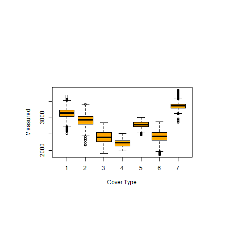

## Forest Cover Type Problem

The US Forest Service and the US Geological Survey created data from 4 wildlife areas in Colorado. The four wilderness areas are: Rawah Wilderness Area, Neota Wilderness Area, Comanche Peak Wilderness Area, and Cache la Poudre Wilderness. Area

They created several features to try to predict which forest cover type existed in each location.  Those cover types are:

- Spruce/Fir
- Lodgepole Pine
- Ponderosa Pine
- Cottonwood/Willow
- Aspen
- Douglas-fir
- Krummholz


--- .class #id 

## Kaggle

Kaggle offers competitive data science competitions for all kinds of problems.  They have a wide range of problems everything from truly cutting edge stuff to problems that have been solved for a while.  
For this problem they posted a training set of 15118 samples and 54 different features. Plus one more column for the id number and one more column for the output.


```r
Data <- read.csv("./data/Data.csv")

dim(Data)
```

```
## [1] 15120    56
```


--- .class #id 

## Exploratory Data Analysis
This app contains a tab to explore the data.  You can try out different features and see how they interact with the different forest cover types.  One example of that is the box plot below.  This can be used to quickly look through large amounts of data and see if there are any trends.


```r
par(pin=c(4,2))
boxplot(Elevation ~Cover_Type, data = Data,col="orange",xlab="Cover Type",ylab="Measured")
```

 

--- .class #id 

## Prediction
For this app a gradient boosted tree method was used.  On out of sample data it has a 75.4% accuracy.  There are several sliders and drop down menus to select amd adjust the different features.  It will make a prediction based on that model.

Thank you and I hope you enjoy the app!

